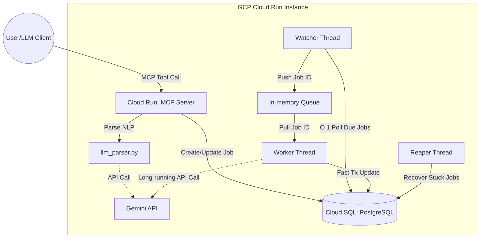

# Project Architecture Overview

## Executive Summary
The MCP Task Scheduler is a robust, production-grade scheduling service designed to bridge the gap between natural language commands (via the Model Context Protocol, MCP) and background job execution. It has evolved from a local SQLite prototype into a scalable **GCP-managed architecture**. Leveraging **Cloud Run** for zero-maintenance compute and **Cloud SQL (PostgreSQL 15)** for concurrent database access, the system allows users to schedule, manage, and execute delayed or recurring tasks described in natural language. An integrated **Gemini LLM** parser transforms raw user prompts into structured tasks, and background worker threads execute these tasks using optimized split-transactions.

The core technology stack consists of **Python 3.13**, using the **mcp** and **fastmcp** SDKs for the server interface, **SQLAlchemy** for database ORM, and the **uv** package manager.

## File Structure
```text
.
├── deploy.sh            # GCP deployment script for Cloud Run and Cloud SQL
├── Dockerfile           # Multi-stage Docker build for runtime container
├── pyproject.toml       # Project dependencies and configuration
├── app/
│   ├── __init__.py
│   ├── database.py      # SQLAlchemy setup and Cloud SQL IAM authentication
│   ├── llm_parser.py    # Gemini-based NLP parser mapping queries to task schemas
│   ├── mcp_server.py    # MCP server implementation and tool handlers
│   ├── migrate.py       # Idempotent schema migration scripts
│   ├── models.py        # Database models (Job) and DB indices
│   └── scheduler.py     # Background watcher, worker, and reaper threads
├── artifacts/           # Project specifications and architecture docs
├── README.md            # Project overview and setup instructions
└── PROMPT.md            # System requirements and design questions
```

## Module Functionalities

### `app/`
- **`database.py`**: Configures the database connection using SQLAlchemy. It supports dynamic Cloud SQL IAM authentication using `google-cloud-sql-connector` for passwordless connections in production, while falling back to standard URLs or SQLite for local development.
- **`models.py`**: Defines the `Job` database model, tracking task parameters (scheduled times, cron expressions, timezones) and statuses (pending, running, completed, failed, cancelled). It incorporates advanced optimizations, such as **Partial Indices** (`idx_pending_scheduler`), to drastically improve watcher loop efficiency by only indexing pending jobs.
- **`scheduler.py`**: Contains the core background execution logic.
    - `get_time_bucket`: Converts scheduled times to an hourly bucket string, acting as a partition key for efficient database querying.
    - `find_due_jobs`: Utilizes partial indices and time buckets to swiftly query due jobs without full table scans.
    - `watcher_loop`: A read-only thread that periodically scans the database for due jobs and pushes their IDs to an in-memory queue.
    - `worker_loop`: Pulls jobs from the queue and executes them using the Gemini LLM API via a split-transaction pattern to protect connection pools.
    - `reaper_loop`: A fault-tolerance thread that recovers jobs stuck in the 'running' state if a worker crashes.
    - `start_scheduler`: Initializes and starts the background daemon threads.
- **`mcp_server.py`**: Acts as the primary entry point and strict middleware boundary for the MCP server.
    - Defines MCP tools: `task_create`, `task_list`, `task_status`, `task_cancel`, and `nlp_task_create`.
    - Handles incoming natural language requests and delegates parsing to the LLM parser before interacting with the database.
- **`llm_parser.py`**: A specialized LLM parser using Pydantic schemas. It intercepts free-form natural language queries and strictly parses them into deterministic scheduling parameters before database insertion.
- **`migrate.py`**: Handles database schema migrations idempotently, introspecting existing tables and applying necessary permissions (e.g., `GRANT ALL ... TO public` for PostgreSQL 15+).

## Architecture & Data Flow

The system follows a producer-consumer pattern mediated by a PostgreSQL database and an in-memory queue, deployed across managed GCP services.



### Step-by-Step Flow:
1. **Task Creation**: A user provides a natural language task description. The MCP server calls `nlp_task_create`, routes it to `llm_parser.py` (which uses Gemini to extract structured data), and saves a new `Job` record to the database with a `pending` status.
2. **Watching**: The read-only `watcher_loop` runs every 10 seconds. It efficiently queries the DB using the `time_bucket` and partial indices for `pending` jobs where `scheduled_at <= now()`.
3. **Queuing**: Found job IDs are tracked in a `ThreadSafeSet` to simulate a "queued" state without write-lock penalties, and their IDs are pushed to the `GLOBAL_JOB_QUEUE`.
4. **Execution**: The `worker_loop` waits for IDs. It uses a **split-transaction**: first, a fast DB update sets the status to `running`. The session closes, and the LLM execution runs. Finally, a second fast transaction saves the result and marks it `completed`.
5. **Recovery**: If a worker crashes mid-execution, the `reaper_loop` identifies tasks stuck in `running` for > 5 minutes and resets them to `pending`.

## Dependencies & Tech Stack
- **Core Framework**: [mcp](https://modelcontextprotocol.io/), [fastmcp](https://github.com/jlowin/fastmcp)
- **Data Layer**: SQLAlchemy 2.0, Cloud SQL PostgreSQL 15 (via `pg8000` & `google-cloud-sql-connector`)
- **AI / LLM**: `google-genai` (Gemini 2.5 API)
- **Infrastructure**: GCP Cloud Run, Cloud SQL, Secret Manager, Artifact Registry
- **Project Management**: [uv](https://github.com/astral-sh/uv), Docker

## Architectural Standards & Patterns
- **Split-Transaction Worker**: External network I/O (Gemini calls) must never be performed while holding an active database session/connection. This prevents `QueuePool` exhaustion.
- **Read-Only Watcher**: Polling threads must not perform database writes (like updating a status to 'queued') to avoid write-lock contention. The UI dynamically projects the 'queued' state using an in-memory `ThreadSafeSet`.
- **Stateless IAM Security**: No hardcoded passwords or `.env` files are used in production. Cloud Run explicitly binds to a Service Account, and the connector requests short-lived OAuth2 tokens for database authentication.
- **Middleware Guardrails**: Raw LLM outputs are never trusted. All natural language inputs must be strictly coerced into Pydantic schemas by a secondary parser before interacting with core application logic.
- **Queueing Layer**: Protects the database from excessive polling by the worker and ensures tasks are processed sequentially within an instance.
- **Time Bucket Partitioning & Partial Indices**: Jobs are grouped into hourly buckets, and a partial index (`idx_pending_scheduler`) strictly over pending jobs ensures fast fault recovery queries without the overhead of indexing millions of completed tasks.

## Best Practices for Execution
1. **Thread Safety**: The system safely manages concurrent watcher, worker, and MCP server access via proper session handling and `ThreadSafeSet` primitives.
2. **Error Handling & Timeouts**: Worker execution is wrapped in try-except blocks, and LLM calls use a `ThreadPoolExecutor` with a strict `timeout=60` to ensure hung Gemini API calls do not permanently block threads.
3. **Graceful Shutdown**: Background threads are started as `daemon=True`, ensuring they terminate when the main Cloud Run container exits.
