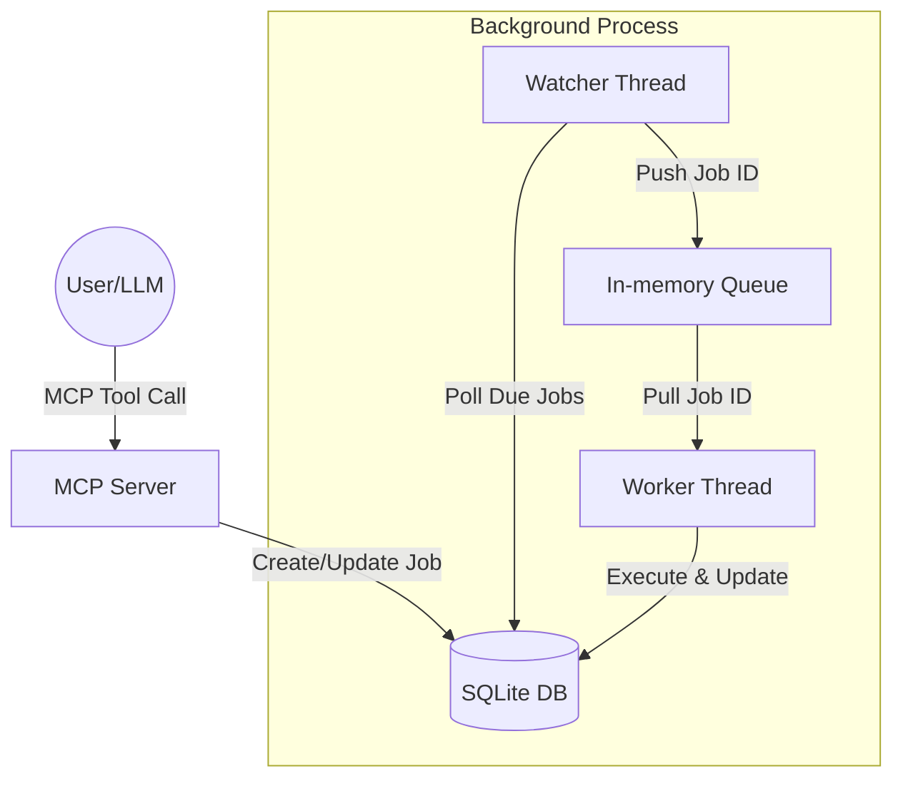

# Project Architecture Overview

## Executive Summary
This project is a **ChatGPT Task Scheduler Prototype**, implemented as a Model Context Protocol (MCP) server. It allows users (typically through an AI assistant like Claude) to schedule, list, monitor, and cancel future tasks. The system is designed with a decoupled architecture that separates the API/Interface layer from the background execution logic, ensuring scalability and reliability.

The core technology stack consists of **Python 3.13**, using the **mcp** and **fastmcp** SDKs for the server interface, **SQLAlchemy** for database ORM, and **SQLite** as the persistent storage layer. The project is managed using the **uv** package manager.

## File Structure
```text
.
├── app/
│   ├── __init__.py
│   ├── database.py      # SQLAlchemy setup and session management
│   ├── mcp_server.py    # MCP server implementation and tool handlers
│   ├── models.py        # Database models (Job) and DB indices
│   └── scheduler.py     # Background watcher and worker threads
├── artifacts/           # Project specifications and architecture docs
├── pyproject.toml       # Project dependencies and configuration
├── README.md            # Project overview and setup instructions
└── PROMPT.md            # System requirements and design questions
```

## Module Functionalities

### `app/`
- **`database.py`**: Configures the SQLite database connection using SQLAlchemy. It provides the `engine`, `SessionLocal`, and a `get_db` generator for session management.
- **`models.py`**: Defines the `Job` database model, which tracks task descriptions, scheduled execution times, statuses (pending, queued, running, completed, failed, cancelled), and results. It incorporates advanced database optimizations, such as **Partial Indices** (`idx_pending_scheduler`), to drastically improve watcher loop efficiency by only indexing pending jobs.
- **`scheduler.py`**: Contains the background execution logic.
    - `get_time_bucket`: Converts scheduled times to an hourly bucket string (e.g., `2025030114`), acting as a partition key for efficient database querying.
    - `find_due_jobs`: Utilizes partial indices and time buckets to swiftly query due jobs without full table scans.
    - `watcher_loop`: Periodically scans the database for jobs that are due and pushes them to an in-memory queue.
    - `worker_loop`: Pulls jobs from the queue and simulates execution, updating their status in the database.
    - `start_scheduler`: Initializes and starts the watcher and worker as daemon threads.
- **`mcp_server.py`**: The main entry point for the MCP server.
    - Defines MCP tools: `task_create`, `task_list`, `task_status`, and `task_cancel`.
    - Implements pure business logic tool handlers that interact with the database via injected sessions.
    - Uses a `TOOL_REGISTRY` pattern to route incoming MCP tool calls to the appropriate handlers cleanly.

## Architecture & Data Flow

The system follows a producer-consumer pattern mediated by a database and an in-memory queue.



### Step-by-Step Flow:
1. **Task Creation**: A user provides a task description and a scheduled time. The MCP server calls `task_create`, which saves a new `Job` record to the database with a `pending` status and computes its `time_bucket`.
2. **Watching**: The `watcher_loop` runs every 10 seconds (default). It efficiently queries the DB using the `time_bucket` and partial indices for `pending` jobs where `scheduled_at <= now()`.
3. **Queuing**: Found jobs are updated to `queued` status and their IDs are pushed to the `job_queue`.
4. **Execution**: The `worker_loop` waits for IDs in the `job_queue`. When an ID is received, it updates the job status to `running`, performs the task (simulated), and then updates the status to `completed` (or `failed`) with the result.

## Dependencies & Tech Stack
- **Core Framework**: [mcp](https://modelcontextprotocol.io/), [fastmcp](https://github.com/jlowin/fastmcp)
- **Data Layer**: SQLAlchemy 2.0, SQLite
- **Project Management**: [uv](https://github.com/astral-sh/uv)
- **Testing**: [pytest](https://docs.pytest.org/), [MCP Inspector](https://github.com/modelcontextprotocol/inspector)

## Architectural Standards & Patterns
- **Watcher/Worker Separation**: Decouples job discovery (scanning) from job execution, allowing them to scale or fail independently.
- **Queueing Layer**: Protects the database from excessive polling by the worker and ensures tasks are processed in order.
- **Registry Pattern**: The MCP server uses a dictionary-based registry (`TOOL_REGISTRY`) to map tool names to handler functions, facilitating easier extension without long conditional blocks.
- **Time Bucket Partitioning**: Jobs are grouped into hourly buckets to optimize database queries, preventing performance degradation as the number of jobs grows.
- **Partial Indexing for Watcher Optimization**: A SQLite partial index (`idx_pending_scheduler`) is specifically built over pending jobs to ensure fast fault recovery queries without the overhead of indexing completed tasks.
- **Immutability & Dependency Injection**: Following coding standards, the system avoids mutating shared state where possible, and passes dependencies (like the DB session) directly into tool handlers to decouple logic from connections.

## Best Practices for Execution
1. **Thread Safety**: The SQLAlchemy engine is configured with `check_same_thread=False` to allow multi-threaded access from the watcher, worker, and MCP server.
2. **Error Handling**: Worker execution is wrapped in try-except blocks to ensure job failures are captured and recorded in the database without crashing the worker thread.
3. **Graceful Shutdown**: Background threads are started as `daemon=True`, ensuring they terminate when the main MCP server process exits.
